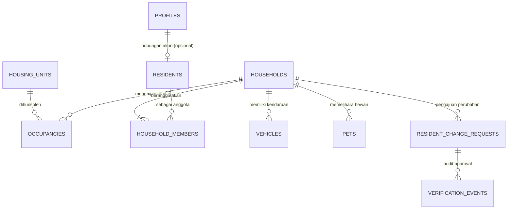

# Rencana Pengembangan Pendataan Warga CGV10

Dokumen ini adalah rencana arsitektur dan tahapan implementasi pendataan warga terintegrasi pada Portal Warga CGV10 (RT 010 / RW 021).

---

## 1. Tujuan & Prinsip Utama
- Membangun sumber data warga yang rapi, akurat, dan terstruktur untuk operasional RT.
- Menjaga pendaftaran awal warga tetap sederhana dan ramah pengguna (nama, cluster, nomor rumah, WhatsApp, email, password).
- Memisahkan secara tegas antara **Akun Pengguna**, **Individu Warga**, **Keluarga/KK**, dan **Unit Rumah Fisik**.
- Menjamin privasi dan keamanan data (NIK & No. KK tidak terekspos ke publik/security/warga lain).
- Kompatibilitas penuh (backward-compatible) dengan fitur eksisting (Buku Tamu Security, PALUGADA, Iuran/Billing, Permintaan Layanan).

---

## 2. Model Relasi Data (Additive)

### Tabel Entitas:
1. `public.housing_units`: Unit fisik alamat (`cluster`, `unit_number`, `normalized_unit`, `address_detail`, `is_active`).
2. `public.households`: Entitas Keluarga/KK (`kk_number`, `primary_contact_name`, `primary_phone`, `verification_status`, `is_active`).
3. `public.occupancies`: Status & Riwayat Hunian (`household_id`, `housing_unit_id`, `ownership_status`, `start_date`, `end_date`, `is_active`).
4. `public.residents`: Individu Warga (`full_name`, `nik`, `gender`, `birth_date`, `phone`, `occupation`, `status_warga`, `user_id`).
5. `public.household_members`: Keanggotaan Keluarga (`household_id`, `resident_id`, `relationship_to_head`, `family_member_status`, `can_manage_data`).
6. `public.vehicles`: Data Kendaraan (`household_id`, `resident_id`, `vehicle_type`, `brand_model`, `year`, `color`, `plate_number`, `plate_normalized`, `ownership_status`).
7. `public.pets`: Data Hewan (`household_id`, `resident_id`, `pet_type`, `breed_name`, `quantity`, `is_vaccinated`, `vaccine_date`, `is_caged`).
8. `public.resident_change_requests`: Draft & Pengajuan Perubahan Data Keluarga (`household_id`, `submitted_by_user_id`, `status`, `proposed_changes_json`, `current_snapshot_json`, `admin_notes`).
9. `public.verification_events`: Audit trail verifikasi dan persetujuan pengurus.

---

## 3. Matriks Hak Akses & Privasi

| Entitas Data | Warga Pemilik Data | Pengurus (RT/Admin) | Bendahara | Security | Publik |
| :--- | :---: | :---: | :---: | :---: | :---: |
| **Cluster & Unit Fisik** | Read/Update (milik sendiri) | Full Access | Read Only | Read Only (tujuan tamu) | Read (Pilihan pendaftaran) |
| **No. KK & NIK** | Read/Edit (milik sendiri) | Read (Masked UI) / Verify | No Access | No Access | No Access |
| **Anggota Keluarga** | Read/Draft/Submit (milik sendiri) | Full Access (Review) | No Access | No Access | No Access |
| **Kendaraan & Hewan** | Read/Draft/Submit (milik sendiri) | Full Access (Review) | No Access | No Access | No Access |
| **Iuran / Tagihan** | Read (milik sendiri) | Full Access | Full Access | No Access | No Access |
| **Lapak PALUGADA** | Manage (lapak sendiri) | Moderate/Verify | No Access | No Access | Read (Katalog publik) |

---

## 4. Tahapan Pengerjaan

### Tahap 1 — Fondasi Database & Registrasi Sederhana
- Migrasi SQL additive untuk tabel unit, hunian, warga, keluarga, membership, dan relasi draft.
- RLS policies & RPC function approval yang diperbarui.
- Penyempurnaan UI Form Registrasi (`/masuk`): label "Nama lengkap Anda", searchable cluster select, normalisasi nomor WA, password requirements & visibility toggle, autofocus/autofill support.

### Tahap 2 — Portal Warga: Menu "Data Keluarga" & Alur Draft
- Halaman `/portal/data-keluarga` dengan ringkasan status kelengkapan data.
- Editor multi-section: Identitas KK & Hunian, Repeater Anggota Keluarga (hitung usia & kategori anak/lansia otomatis).
- Fitur Simpan Draft (lokal/staging) dan Kirim untuk Diperiksa Pengurus.

### Tahap 3 — Kendaraan, Hewan Peliharaan & Review Pengurus
- Repeater Kendaraan (Mobil, Motor, Sepeda, Lainnya) & Hewan Peliharaan (Status Vaksin, Tanggal, Dikandangkan).
- Portal Pengurus (`/admin/warga` & `/admin/data-warga`): Diff Viewer perbandingan usulan perubahan data vs data aktif sebelumnya.
- Action Approve / Minta Perbaikan dengan audit trail.

### Tahap 4 — Import Excel & Dashboard Rekap RT
- Parser template Excel `Data Base_Pendataan_Warga_RT010_RW021` (Sheet DATA KK, ANGGOTA KELUARGA, KENDARAAN, HEWAN PELIHARAAN).
- UI Importer dengan preview validasi baris, dry-run, dan batch commit tanpa duplikasi.
- Dashboard Rekap RT real-time berbasis agregasi database.
